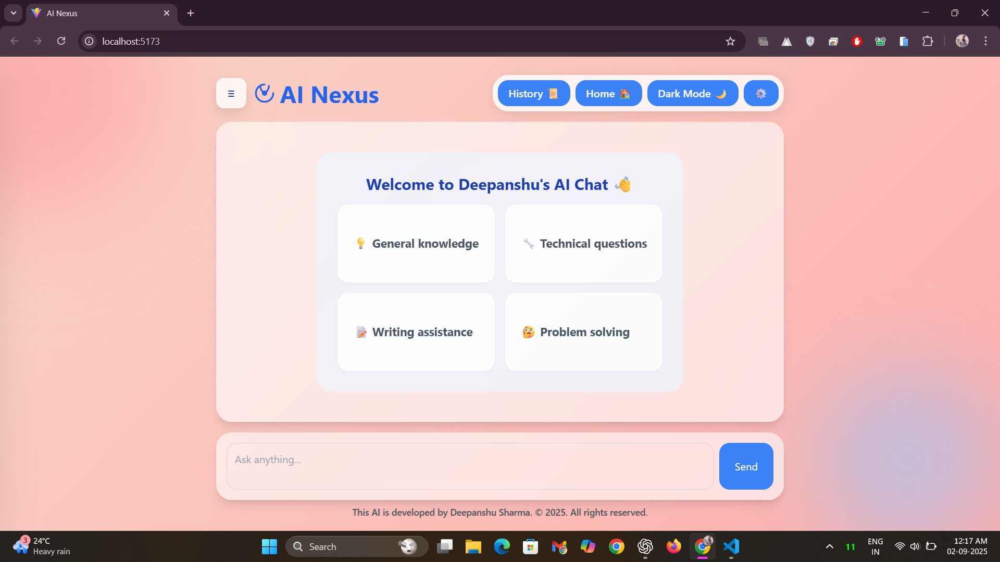

# 🤖 AINexus-Powered-By-Gemini

[](https://vitejs.dev/) 
[](https://reactjs.org/) 
[](https://tailwindcss.com/) 
[](https://axios-http.com/) 
[](https://github.com/remarkjs/react-markdown) 
[](https://developer.mozilla.org/docs/Web/JavaScript) 
[](https://socket.io/) 
[](#) 
[](LICENSE)

**AI Nexus is a real-time AI chatbot powered by the Google Gemini API, built using React, Vite, Tailwind CSS, JavaScript (ES6+), and Socket.io.**

---

## 🌟 Overview
AINexus provides a responsive, interactive chat experience. Users can ask questions and get AI-generated answers in real-time, powered by Google Gemini API. It’s designed for smooth conversations and a clean user interface.

---

## 🌟 Live Demo
[Chat with AINexus Here](http://ainexus-online.netlify.app)

---

## ⚡ Features & Tech Stack
- **Real-time AI chat:** Seamless communication with the Gemini model.  
- **Responsive UI/UX:** Clean, user-friendly interface with Tailwind CSS and modern design principles.  
- **JavaScript (ES6+):** Modern syntax features for cleaner, more efficient, and scalable code.  
- **Socket.io:** Enables real-time, bi-directional communication between client and server for live AI chat.  
- **Vite:** Fast build tool and development server with hot-reloading.  
- **React:** Core library for building the UI and managing components.  
- **Axios:** Handles API requests to the Google Gemini API.  
- **ReactMarkdown:** Renders AI responses with proper formatting.

---

## ✨ Highlights
- 🎨 **Glassmorphism UI** – Modern glass-style design with layered transparency and smooth gradients for a futuristic look.  
- ⚡ **Fluid Animations** – Lightweight motion effects make interactions seamless and engaging across the app.  
- 💡 **AI Integration** – Powered by advanced machine learning models for natural language understanding, smart responses, and intelligent code generation.  

---

## ✅ Advantages
- Fast, real-time AI responses.  
- Responsive and clean UI.  
- Scalable, modular, and maintainable React codebase.  
- Supports rich text and Markdown formatting for AI answers.

---

## 📸 Screenshots

### Home (Dark Mode)
  
*AI Nexus home interface powered by Gemini, running a multi-modal AI pipeline for smooth human-AI interaction.*

### AI Response
  
*Displays context-aware responses where Nexus uses Gemini’s deep language understanding to generate accurate answers.*

### Code Response
  
*A coding environment where Nexus taps into Gemini’s reasoning to produce structured and executable code snippets.*

### Chat History
  
*Shows previous AI interactions, making it easy to track conversation context.*

### Edit and Copy Feature
  
*Allows users to edit their questions and copy AI responses directly for smoother interaction and workflow.*

### Settings & Typing Speed
  
*Allows customization of AI response speed and personalization of interaction settings.*

### Mobile View 
  
*Responsive design ensures seamless AI interactions on mobile devices with adaptive layouts.*

### Home (Light Mode)
  
*Light theme version of AI Nexus showing clean design with Gemini-driven semantic response alignment.*

---

## 🛠 Installation

```bash
# Clone the repository
git clone <your-repo-link>

# Navigate to the project folder
cd AINexus-Powered-By-Gemini

# Install dependencies
npm install

# Start the development server
npm run dev
